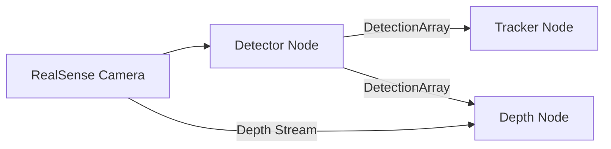

# RealSense D435i Detection, Tracking, and Depth Estimation

This project implements real-time object detection, tracking, and 3D position estimation using an Intel RealSense D435i camera. The system is built using ROS 2 and consists of three main nodes that work together to process the camera feed.

## System Architecture

The system consists of three main nodes:

1. **Detector Node**: Performs object detection using YOLOX-S
2. **Tracker Node**: Tracks detected objects using ByteTrack
3. **Depth Node**: Estimates 3D positions of tracked objects with respect to the camera. This can be used to localize the detected objects.

### Data Flow



## Features

- Real-time object detection using YOLOX-S model
- Multi-object tracking using ByteTrack algorithm
- 3D position estimation using depth camera
- Visualization of detection and tracking results
- Point cloud generation for detected objects

## Prerequisites

- ROS 2 Humble
- Python 3.10+
- PyTorch
- ROS 2 RealSense Wrapper (`ros2-humble-realsense2-camera`)
- OpenCV
- NumPy

## Installation

1. Install ROS 2 RealSense packages:

```bash
sudo apt-get install ros-humble-realsense2-camera
```

2. Clone this repository into your ROS 2 workspace:

```bash
cd ~/ros2_ws/src
git clone <repository-url>
```

3. Install Python dependencies:

```bash
pip install torch numpy opencv-python
```

4. Build the workspace:

```bash
cd ~/ros2_ws
colcon build
```

## Node Details

### 1. Detector Node (`detector_node.py`)

- Subscribes to RGB image stream
- Performs object detection using YOLOX-S
- Publishes detection results and visualization
- Configurable confidence and NMS thresholds
- Supports 80 COCO classes

### 2. Tracker Node (`tracker_node.py`)

- Subscribes to detection results
- Implements ByteTrack algorithm for object tracking
- Maintains object IDs across frames
- Publishes tracked object visualization

### 3. Depth Node (`depth_node.py`)

- Subscribes to detection results and depth stream
- Estimates 3D positions of detected objects
- Implements robust depth estimation using statistical filtering
- Publishes 3D detection results

## Usage

1. Launch the RealSense camera, detector, tracker and depth nodes:

```bash
ros2 launch realsense_bringup realsense_app.launch.py
```

## Topics

### Subscribed Topics

- `/camera/color/image_raw` - RGB image from RealSense
- `/camera/aligned_depth_to_color/image_raw` - Aligned depth image
- `/camera/color/camera_info` - Camera calibration info

### Published Topics

- `/detection_results` - Visualization of detected objects
- `/tracking_results` - Visualization of tracked objects
- `/detection_3d` - 3D positions of detected objects
- `/detect_point` - Point cloud of detected object depth

## Configuration

Key parameters can be adjusted in the node initialization:

- Detection confidence threshold: 0.45
- NMS threshold: 0.45
- Tracking threshold: 0.30
- Track buffer size: 30
- Depth sampling window ratio: 0.4
